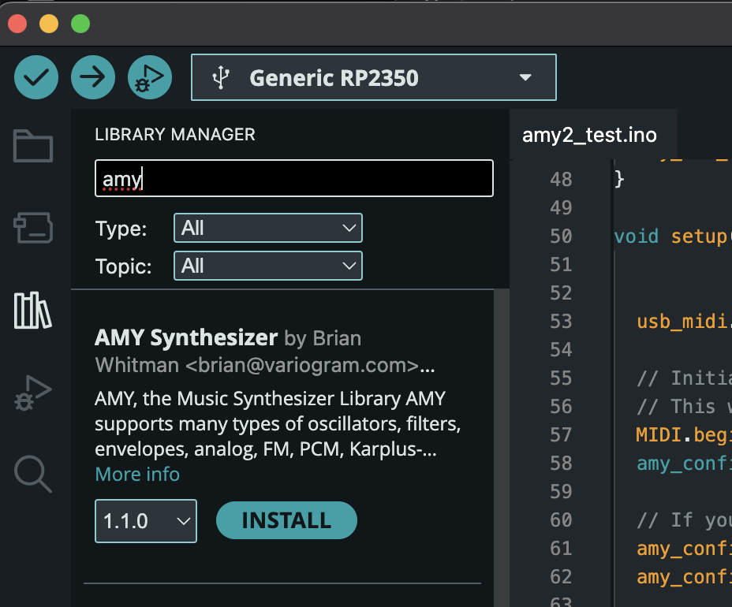

# Arduino Setup for AMY

AMY is on the Arduino Libraries repository. Simply search for "AMY" in the Library Manager and you should find us!



We recommend always using the latest released version (now `1.1.0`) in the Arduino Library Manager. However, if you are directed to a bleeding edge release of AMY, you can simply copy this repository to your `Arduino/libraries` folder as `Arduino/libraries/amy`. (Make sure you delete whatever you already had in `libraries/amy`. 

To use AMY in Arduino, just `#include <AMY-Arduino.h>`. You need at a minimum the following code in your sketch, a call to `amy_start`, then `amy_live_start` if you are using our I2S or USB audio code, and then a call to `amy_update()` somewhere in your `loop()`. 

```c

void setup() {
  // .. in your setup ...
  amy_config_t amy_config = amy_default_config();
  // set your pins, etc -- see the AMY_MIDI_Synth example
  amy_start(amy_config);
  amy_live_start();
}

void loop() {
  // Your loop() must contain this call to amy:
  amy_update(); 
}
```

AMY in Arduino handles MIDI input and output as well as I2S and USB (where supported) audio. You do not need to set up an I2S interface, just the pins. 

For experts: if you're rendering AMY audio to your own audio hardware, you can omit the call to `amy_live_start()` and call our [`amy_simple_fill_buffer()` API](api.md) in `loop()` instead. This gives you a buffer of stereo 16-bit short integers to send out to whatever interface you set up.

[Please see our latest matrix of supported features per chip/board.](https://github.com/shorepine/amy/issues/354)

We ship a single example in the Examples folder for AMY called `AMY_MIDI_Synth`. It receives MIDI input and plays a Juno-6 patch 0 in response. should work on all our supported boards. Make sure you've installed the board support package for the board / chip you are using:

 * RP2040 / RP2350 / Pi Pico: [`arduino-pico`](https://arduino-pico.readthedocs.io/en/latest/install.html#installing-via-arduino-boards-manager)
 * Teensy: [`teensyduino`](https://www.pjrc.com/teensy/td_download.html)
 * ESP32 / ESP32-S3 / etc: [`arduino-esp32`](https://espressif-docs.readthedocs-hosted.com/projects/arduino-esp32/en/latest/installing.html)
 * Electrosmith Daisy: [`DaisyDuino`](https://daisy.audio/tutorials/arduino-dev-env/)

You can use both cores of supported chips (RP2040, RP2350 or ESP32 variants) for more oscillators and voices.

Once you've confirmed AMY is running on your chip, read our [tutorial](tutorial.html) or our [getting started](../README.md) page on how to control AMY in Arduino:

```c
// Will play MIDI note 50 on patch 130
amy_event e = amy_default_event();
e.osc = 0;
e.patch_number = 130;
e.velocity = 1;
e.midi_note = 50;
e.voices = '0'
amy_add_event(e);
```

## Per-board notes

### ESP32, ESP32-S3, ESP32-P4

Tested: Arduino IDE 2.3.6 (mac)


### Teensy 4.0, 4.1

Tested: Arduino IDE 2.3.6 (mac) + [Teensy 1.59.0](https://www.pjrc.com/teensy/teensyduino.html)

USB audio and i2s audio output happen at the same time

if you set USB Type to Audio, it will appear as a USB audio device on your computer, called "AMY Synthesizer"

Note: USB audio from Teensy is fiddly and often slow to enumerate, i have to wait a minute or two before it shows up on my Mac. This seems to be unrelated to AMY. Please ask on the Teensy forums if you're having trouble with USB Audio. Once it is enumerated and running, it does seem stable.

For I2S, you have to use the default i2s1 pins. The pins you set in AMY config are ignored. That's `21 -> BLCK`, `20 -> LRC`, `DOUT -> 7`

For UART MIDI, we use Serial8, the pins you set in AMY config are ignored. That's `MIDI_OUT -> 35`, `MIDI_IN -> 34`.


### Pi Pico RP2040 and Pi Pico 2 RP2350

Tested: Arduino IDE 2.3.6 (mac)

The `i2s_lrc` pin has to be `i2s_bclk` + 1.


### Electro-Smith Daisy Seed

See [Daisy README](../daisy/README.md)

