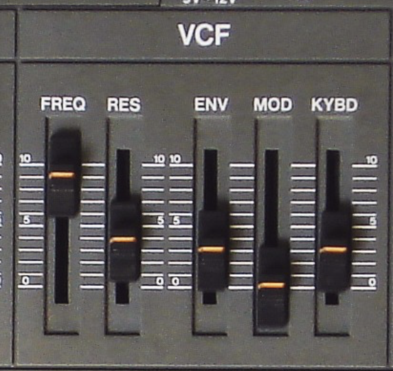

# AMY Synthesizer Details

[**Please see our interactive AMY tutorial for more tips on using AMY**](https://shorepine.github.io/amy/tutorial.html)

- [AMY Synthesizer Details](#amy-synthesizer-details)
  * [Oscillators, voices, patches and synths](#oscillators--voices--patches-and-synths)
    + [User patches](#user-patches)
    + [Synths](#synths)
  * [CtrlCoefficients](#ctrlcoefficients)
  * [AMY's sequencer and timestamps](#amy-s-sequencer-and-timestamps)
    + [The sequencer](#the-sequencer)
  * [Core oscillators](#core-oscillators)
  * [LFOs & modulators](#lfos---modulators)
  * [Filters](#filters)
  * [EQ & Volume](#eq---volume)
  * [Envelope Generators](#envelope-generators)
  * [Audio input and effects](#audio-input-and-effects)
  * [FM & ALGO type](#fm---algo-type)
  * [Build-your-own Partials](#build-your-own-partials)
  * [Interpolated partials](#interpolated-partials)
  * [PCM](#pcm)
  * [Sampler (aka Memory PCM)](#sampler--aka-memory-pcm-)


## Oscillators, voices, patches and synths

Here's a diagram of how AMY manages oscillators,  and synths. This is an example of a six polyphony Juno-6 synth. Each voice represents one unit of polyphony, and the 5 oscillators that are needed to make up the voice. The synth manages 6 voices:

<picture>
  <source media="(prefers-color-scheme: dark)" srcset="./amy_dark.png">
  
</picture>

AMY's lowest level of control is the `osc`illator - a single waveform that you can define a number of parameters for, apply filters, frequency, pan, etc. By default AMY ships with support for 180 oscillators running at once. (You can increase this with [`amy_config`](api.md).)

We then provide `voices`, to make it easier to configure and use groups of oscillators in coordination. For example, each Juno-6 note is generated by a single voice made from 5 oscillators. 

You then manage a set of `voices` using a `synth`, which takes care of allocating available voices to successive notes. For example a Juno-6 synth can play 6 notes of a patch at once. The `synth` in AMY allocates 6 `voices`, each with 5 `osc`, and handles note stealing and parameter changes. 

You configure the `voices` in a `synth` by using a `patch`, which is a number referring to a stored list of AMY commands that set up one or more oscillators.  You can assign any patch to any synth, or set up multiple synths to have the same patch, and AMY will allocate the oscillators it needs under the hood. 

(Note that when you use voices/synths, you'll need to include the `synth` arg when addressing oscillators, and AMY will automatically route your command to the relevant oscillators in each voice of the synth's set -- there's no other way to tell which oscillators are being used by which voices.)

To play a patch -- for instance the built-in patches emulating Juno and DX7 synthesizers and a piano -- you create a synth configured with that patch, then send note events, or parameter moidifications, to the synth. We ship patches 0-127 for Juno, 128-255 for DX7, and 256 for our [built in piano](https://shorepine.github.io/amy/piano.html). For example, a multitimbral Juno/DX7 synth can be set up like this:

```python
amy.send(synth=1, num_voices=4, patch=1)     # 4 voices of Juno patch #1 on synth 1
amy.send(synth=2, num_voices=4, patch=129)   # 4 voices of DX7 patch #2 on synth 2
amy.send(synth=1, note=60, vel=1)            # Play note 60 on one of the Juno voices
amy.send(synth=1, osc=0, filter_freq=8000)   # Open up the filter on the Juno voices (using its first oscillator)
```

The code in `amy/headers.py` generates these patches and bakes them into AMY so they're ready for playback on any device. You can add your own patches at compile time by storing alternative wire-protocol setup strings in `patches.h`, or by making user patches at runtime:

### Synths

A common use-case is to want a pool of voices which are allocated to a series of notes as-needed.  This is accomplished with **synths**.  You associate a synth number with a set of voices by providing the patch number when initializing the synth; the `synth` arg becomes a smart alias for passing note events to one of its voices (or configuration changes to all of them), e.g.

```python
amy.send(synth=0, num_voices=3, patch=1)     # 3-voice Juno path #1 on synth 0
# Play three notes simultaneously
amy.send(synth=0, note=60, vel=1)
amy.send(synth=0, note=64, vel=1)
amy.send(synth=0, note=67, vel=1)
# To play a 4th note, the synth 'steals' the oldest voice, i.e. the one that was playing note 60
amy.send(synth=0, note=70, vel=1)
# We can send note-offs to individual notes
amy.send(synth=0, note=70, vel=0)
# .. or we can send note-offs to all the currently-active synth voices by sending a note-off with no note.
amy.send(synth=0, vel=0)
# Once a synth has been initialized and associated with a set of voices, you can use it alone with patch
amy.send(synth=0, patch=13)  # Load a different Juno patch, will remain 4-voice.
# You can release all the voices/oscs being used by a synth by setting its num_voices to zero.
amy.send(synth=0, num_voices=0)
# As a special case, you can use synth_flags to set up a MIDI drum synth that will translate note events into PCM presets
# and patch_string to directly define a patch using a wire-command string.
amy.send(synth=10, num_voices=3, patch_string='w7f0Z', synth_flags=3)
amy.send(synth=10, note=40, vel=1)  # MIDI drums 'electric snare'
```

(Note: Although `note` can take on real values -- e.g. `note=60.5` for 50 cents above C4 -- the voice management tracks voices by integer note numbers (i.e., midi notes) so it rounds note values to the nearest integer when deciding which note-off goes with which note-on.  Note also that note-on events that also set the `preset` parameter (e.g. to select PCM samples) will fold the patch number into the note integer used as the key for note-on, note-off matching.)


### User patches

You can create your own patches at runtime and use them for synths with a sequence of `amy.send(patch=PATCH_NUMBER, <configuration commands>)` where `PATCH_NUMBER` is a number in the range 1024-1055.  Without `patch=PATCH_NUMBER`, this command would directly configure an oscillator, but when `patch` is present, it instead appends the command to the stored patch configuration.  You can accumulate any number of commands into a single patch; you reset the patch with `amy.send(patch=PATCH_NUMBER, reset=amy.RESET_PATCH)`.

So you can do:

```python
>>> import amy; amy.live()  # Not needed on Tulip.
>>> amy.send(patch=1024, reset=amy.RESET_PATCH)
>>> amy.send(patch=1024, osc=1, wave=amy.SINE, freq=0.25, phase=0.5, amp=0.5)  # "Pitch sigh" modulator.
>>> amy.send(patch=1024, osc=0, wave=amy.SINE, freq='261.63,1,0,0,0,1', bp0='0,1,500,0,0,0', mod_source=1)  # decaying sine modulated by sigh.
>>> amy.send(synth=0, num_voices=1, patch=1024)
>>> amy.send(synth=0, vel=2, note=50)
```
AMY infers the number of oscs needed for the patch from the cumulated commands. If you store a new patch over an old one, that old memory is freed and re-allocated. (We rely on `malloc` for all of this.)


## Control Coefficients

On many synths (like this SH-101), you'll see a row of sliders that impact which control signal(s) can modify a parameter. Here the SH-101 lets you control the VCF (filter) by a constant frequency (FREQ), ADSR envelope (ENV), LFO or mod wheel (MOD), and keyboard velocity (KYBD). These slider values impact the ratio of each source's strength in the output filter frequency. 



We use this style of control in AMY, called `CtrlCoef` or Control Coefficients. They are a list of up to 9 floats that are multiplied by a range of control signals, then summed up to give the final result (in this case, the filter frequency).

The full set of parameters accepting **ControlCoefficients** is `amp`, `freq`, `filter_freq`, `duty`, and `pan`.   The control signals are:

 * `const`: A constant value of 1 - so the first number in the control coefficient list is the default value if all the others are zero.
 * `note`: The frequency corresponding to the `note` parameter to the note-on event (converted to unit-per-octave relative to middle C).
 * `vel`: The velocity, from the note-on event.
 * `eg0`: The output of Envelope Generator 0.
 * `eg1`: The output of Envelope Generator 1.
 * `mod`: The output of the modulating oscillator, specified by the `mod_source` parameter.
 * `bend`: The current pitch bend value (from `amy.send(pitch_bend=0.5)` etc.).
 * `ext0`: An external parameter, [set by your code](api.md) or 3rd party CV input or sensor
 * `ext1`: An external parameter, [set by your code](api.md) or 3rd party CV input or sensor

The set `50,0,0,0,1` means that we have a base frequency of 50 Hz, we ignore the note frequency and velocity and EG0, but we also add the output of EG1. Any coefficients that you do not specify, for instance by providing fewer than 7 values, are not modified.  You can also use empty strings to skip positional values, so `filter_freq=',,,,1'` couples EG1 to the filter frequency without changing any of the other coefficients.  (Note that when we passed `freq=220` in the first example, that was interpreted setting the `const` coefficient to 220, but leaving all the remaining coefficients untouched.)

Because entering lists of commas is error prone, you can also specify control coefficients as Python dicts consisting of value with keys from the list above, i.e. `filter_freq={'const': 50, 'eg1': 1}` is equivalent to `filter_freq='50,,,,1'`.

You can use the same EG to control several things at once.  For example, we could include `freq=',,,,0.333'`, which says to modify the note frequency from the same EG1 as is controlling the filter frequency, but scaled down by 1/3rd so the initial decay is over 1 octave, not 3.  Give it a go!

The note frequency is scaled relative to a zero-point of middle C (MIDI note 60, 261.63 Hz), so to make the oscillator faithfully track the `note` parameter to the note-on event, you would use something like `freq='261.63,1'`.  Setting it to `freq='523.26,1'` would make the oscillator always be one octave higher than the `note` MIDI number.  Setting `freq='261.3,0.5'` would make the oscillator track the `note` parameter at half an octave per unit, so while `note=60` would still give middle C, `note=72` (C5) would make the oscillator run at F#4, and `note=84` (C6) would be required to get C5 from the oscillator.

The default set of ControlCoefficients for `freq` is `'261.63,1,0,0,0,0,1'`, i.e. a base of middle C, tracking the MIDI note, plus pitch bend (at unit-per-octave).  Because 261.63 is such an important value, as a special case, setting the first `freq` value to zero is magically rewritten as 261.63, so `freq='0,1,0,0,0,0,1'` also yields the default behavior.  `amp` also has a set of defaults: `amp='0,0,1,1,0,0,0'`, i.e. tracking note-on velocity plus modulation by EG0 (which just tracks the note-on status if it has not been set up).  `amp` is a little special because the individual components are *multiplied* together, instead of added together, for any control inputs with nonzero coefficients.  Finally, an offset of 1.0 is added to the coefficient-scaled LFO modulator and pitch bend inputs before multiplying them into the amplitude, to allow small variations around unity e.g. for tremolo.  These defaults are set up in [`src/amy.c:reset_osc()`](https://github.com/shorepine/amy/blob/b1ed189b01e6b908bc19f18a4e0a85761d739807/src/amy.c#L551).

We also have LFOs, which are implemented as one oscillator modulating another (instead of sending its waveform to the output). You set up the low-frequency oscillator, then have it control a parameter of another audible oscillator. Let's make the classic 8-bit duty cycle pulse wave modulation, a favorite:

```python
amy.reset()  # Clear the state.
amy.send(osc=1, wave=amy.SINE, freq=0.5, amp=1)   # We set the amp but not the vel, so it doesn't sound.
amy.send(osc=0, wave=amy.PULSE, duty={'const': 0.5, 'mod': 0.4}, mod_source=1)
amy.send(osc=0, note=60, vel=0.5)
```

You see we first set up the modulation oscillator (a sine wave at 0.5Hz, with amplitude of 1).  We do *not* send it a velocity, because that would make it start sending a 0.5 Hz sinewave to the audio output; we want its output only to be used internally.  Then we set up the oscillator to be modulated, a pulse wave with a modulation source of oscillator 1 and the duty **ControlCoefficients** set to have a constant value of 0.5 plus 0.4 times the modulating input (i.e., the depth of the pulse width modulation, where 0.4 modulates between 0.1 and 0.9, almost the maximum depth).  The initial duty cycle will start at 0.5 and be offset by the state of oscillator 1 every tick, to make that classic thick saw line from the C64 et al. The modulation will re-trigger every note on. Just like with envelope generators, the modulation oscillator has a 'slot' in the ControlCoefficients - the 6th coefficient, `mod` - so it can modulate PWM duty cycle, amplitude, frequency, filter frequency, or pan! And if you want to modulate more than one thing, like frequency and duty, just specify multiple ControlCoefficients:

```python
amy.send(osc=1, wave=amy.TRIANGLE, freq=5, amp=1)
amy.send(osc=0, wave=amy.PULSE, duty={'const': 0.5, 'mod': 0.25}, freq={'mod': 0.5}, mod_source=1)
amy.send(osc=0, note=60, vel=0.5)
```

We have some helpful patches in `amy.examples`, if you want to use them, or add to them. To make that filter bass, just do `amy.send(synth=0, num_voices=4, patch=amy.examples.filter_bass())` and then `amy.send(synth=0,vel=1,note=50)` to hear it.


## AMY's sequencer and timestamps

AMY can accept a `time` (in milliseconds) parameter to schedule events in the future, and also provides a pattern sequencer for repeating events.

The scheduled events are very helpful in cases where you can't rely on an accurate clock from the client, or don't have one. The clock used internally by AMY is based on the audio samples being generated out the speakers, which should run at an accurate 44,100 times a second.  This lets you do things like schedule fast moving parameter changes over short windows of time. 

```python
start = amy.millis()  # arbitrary start timestamp
amy.send(osc=0, note=50, vel=1, time=start)
amy.send(osc=0, note=52, vel=1, time=start + 1000)
```

Both `amy.send()`s will return immediately, but you'll hear the second note play precisely a second after the first. AMY uses this internal clock to schedule step changes in breakpoints as well. 


### The sequencer

AMY starts a musical sequencer that works on `ticks` from startup. You can reset the `ticks` to 0 with an `amy.send(reset=amy.RESET_TIMEBASE)`. Note this will happen immediately, ignoring any `time` or `sequence`.

Ticks run at 48 PPQ at the set tempo. The tempo defaults to 108 BPM. This means there are 108 quarter notes a minute, and `48 * 108 = 5184` ticks a minute, 86 ticks a second. The tempo can be changed with `amy.send(tempo=120)`.

You can schedule an event to happen at a precise tick with `amy.send(... ,sequence="tick,period,tag")`. `tick` can be an absolute or offset tick number. If `period` is ommited or 0, `tick` is assumed to be absolute and once AMY reaches `tick`, the rest of your event will play and the saved event will be removed from memory. If an absolute `tick` is in the past, AMY will ignore it. 

You can schedule repeating events (like a step sequencer or drum machine) with `period`, which is the length of the sequence in ticks. For example a `period` of 48 with `ticks` omitted or 0 will trigger once every quarter note. A `period` of 24 will happen twice every quarter note. A `period` of 96 will happen every two quarter notes. `period` can be any whole number to allow for complex rhythms. 

For pattern sequencers like drum machines, you will also want to use `tick` alongisde `period`. If both are given and nonzero, `tick` is assumed to be an offset on the `period`. For example, for a 16-step drum machine pattern running on eighth notes (PPQ/2), you would use a `period` of `16 * 24 = 384`. The first slot of the drum machine would have a `tick` of 0, the 2nd would have a `tick` offset of 24, and so on. 

`tag` should be given, and will be `0` if not. You should set `tag` to a random or incrementing number in your code that you can refer to later. `tag` allows you to replace or delete the event once scheduled. 

If you are including AMY in a program, you can set the [hook `void (*amy_external_sequencer_hook)(uint32_t)`](docs/api.md) to any function. This will be called at every tick with the current tick number as an argument. 

## Core oscillators

We support bandlimited saw, pulse/square and triangle waves, alongside sine and noise. Use the wave parameter: 0=SINE, PULSE, SAW_DOWN, SAW_UP, TRIANGLE, NOISE. Each oscillator can have a frequency (or set by midi note), amplitude and phase (set in 0-1.). You can also set `duty` for the pulse type. We also have a karplus-strong type (KS=6). 

Oscillators will not become audible until a `velocity` over 0 is set for the oscillator. This is a "note on" and will trigger any modulators or envelope generators set for that oscillator. Setting `velocity` to 0 sets a note off, which will stop modulators and also finish the envelopes at their release pair. `velocity` also internally sets `amplitude`, but you can manually set `amplitude` after `velocity` starts a note on.

## LFOs & modulators

Any oscillator can modulate any other oscillator. For example, a LFO can be specified by setting oscillator 0 to 0.25Hz sine, with oscillator 1 being a 440Hz sine. Using the 6th parameter of **ControlCoefficient** lists, you can have oscillator 0 modulate frequency, amplitude, filter frequency, or pan of oscillator 1. You can also add targets together, for example amplitude+frequency. Set the `mod_target` and `mod_source` on the audible oscillator (in this case, oscillator 1.) The source mod oscillator will not be audible once it is referred to as a `mod_source` by another oscillator. The amplitude of the modulating oscillator indicates how strong the modulation is (aka "LFO depth.")

## Filters

We support lowpass, bandpass and hipass filters in AMY. You can set `resonance` and `filter_freq` per oscillator. 

## EQ & Volume

You can set a synth-wide volume (in practice, 0-10), or set the EQ of the entire synths's output. 

## Envelope Generators

AMY allows you to set 2 Envelope Generators (EGs) per oscillator. You can see these as ADSR / envelopes (and they can perform the same task), but they are slightly more capable. Breakpoints are defined as pairs of time deltas (specified in milliseconds) and target value. You can specify up to 8 pairs, but the last pair you specify will always be seen as the "release" pair, which doesn't trigger until note off. All preceding pairs have time deltas relative to the previous segment, so `100,1,100,0,0,0` goes up to 1 over 100 ms, then back down to zero over the next 100ms. The last "release" pair counts from ms from the note-off.

An EG can control amplitude, frequency, filter frequency, duty or pan of an oscillator via the 4th (EG0) and 5th (EG1) entries in the corresponding ControlCoefficients.

For example, to define a common ADSR curve where a sound sweeps up in volume from note on over 50ms, then has a 100ms decay stage to 50% of the volume, then is held until note off at which point it takes 250ms to trail off to 0, you'd set time to be 50ms and target to be 1.0, then 100ms with target .5, then a 250ms release with ratio 0. By default, amplitude is set up to be controlled by EG0. At every synthesizer tick, the given amplitude (default of 1.0) will be multiplied by the EG0 value. In AMY wire parlance, this would look like `v0f220w0A50,1.0,100,0.5,250,0` to specify a sine wave at 220Hz with this envelope. 

When using `amy.py`, use the string form of the breakpoint: `amy.send(osc=0, bp0='50,1.0,100,0.5,250,0')`.

Every note on (specified by setting `vel` / `l` to anything > 0) will trigger this envelope, and setting velocity to 0 will trigger the note off / release section.

You can set a completely separate envelope using the second envelope generator, for example, to change pitch and amplitude at different rates.

As with ControlCoefficients, missing values in the comma-separated parameter strings mean to leave the existing value unchanged.  However, unlike ControlCoefficients, it's important to explicitly indicate every value you want to leave unchanged, since the number of parameters provided determines the number of breakpoints in the set.  So in the following sequence:
```
amy.send(osc=0, bp0='0,1,1000,0.1,200,0')
amy.send(osc=0, bp0=',,,0.9,,')
```
.. we end up with the same effect as `bp0='0,1,1000,0.9,200,0`.  However, if we do:
```
amy.send(osc=0, bp0='0,1,1000,0.1,200,0')
amy.send(osc=0, bp0=',,,0.9')  # No trailing commas.
```
.. we effectively end up with `bp0='0,1,1000,0.9`, i.e. the 4 elements in the second `bp0` string change the first breakpoint set to have only 2 breakpoints, meaning a constant amplitude during note-on, then a final slow release to 0.9 -- not at all like the first form, and likely not what we wanted.

## Audio input and effects

By setting `wave` to `AUDIO_IN0` or `AUDIO_IN1`, you can have either channel of a stereo input act as an AMY oscillator. You can use this oscillator like you would any other in AMY, apply global effects to it, add filters, change amplitude, etc. 

```
amy.send(osc=0, wave=amy.AUDIO_IN0, vel=1)
amy.echo(1, 250, 250, 0.5, 0.5)
```

If you are building your own audio system around AMY you will want to fill in the buffer `amy_in_block` before rendering. Our included `miniaudio`-based system does this for you. See [`amychip`](https://github.com/shorepine/amychip) for a demo of this in hardware. 

## FM & ALGO type

Try default DX7 patches, from 128 to 256:

```python
amy.send(synth=0, num_voices=1, patch=128)  # Set up a voice.
amy.send(synth=0, note=50, vel=1)  # Play a note on the voice.
```

The `patch` lets you set which preset is used (0 to 127 are the Juno 106 analog synth presets, and 128 to 255 are the DX7 FM presets).  But let's make the classic FM bell tone ourselves, without a patch. We'll just be using two operators (two sine waves), one modulating the other.


When building your own algorithm sets, assign a separate oscillator as wave=`ALGO`, but the source oscillators as `SINE`. The algorithm #s are borrowed from the DX7. You don't have to use all 6 operators. Note that the `algo_source` parameter counts backwards from operator 6. When building operators, they can have their frequencies specified directly with `freq` or as a ratio of the root `ALGO` oscillator via `ratio`.

[**Please see our interactive AMY tutorial for more on setting up ALGO tones**](https://shorepine.github.io/amy/tutorial.html#fm-tones)


## Build-your-own Partials

You can also explicitly control partials in "build-your-own partials" mode, accessed via `wave=amy.BYO_PARTIALS`.  This sets up a string of oscs as individual sinusoids, but it's up to you to control the details of each partial via its parameters, envelopes, etc.  You just have to say how many partials you want with `num_partials`.  You can then individually set up the amplitude `bp0` envelopes of the next `num_partials` oscs for arbitrary control, subject to the limit of 7 breakpoints plus release for each envelope.  For instance, to get an 8-harmonic pluck tone with a 50 ms attack, and harmonic weights and decay times inversely proportional to to the harmonic number:

```python
num_partials = 8
amy.send(osc=0, wave=amy.BYO_PARTIALS, num_partials=num_partials)
for i in range(1, num_partials + 1):
    # Set up each partial as the corresponding harmonic of 261.63
    # with an amplitude of 1/N, 50ms attack, and a decay of 1 sec / N.
    amy.send(osc=i, wave=amy.PARTIAL, freq=261.63 * i,
             bp0='50,%.2f,%d,0,0,0' % ((1.0 / i), 1000 // i))
amy.send(osc=0, note=60, vel=1)
```

You can add a filter (or an envelope etc.) to the sum of all the `PARTIAL` oscs by configuring it on the parent `BYO_PARTIALS` osc:

```
amy.send(osc=0, filter=amy.FILTER_HPF, resonance=4, filter_freq={'const': 200, 'eg1': 4}, bp1='0,0,1000,1,0,0')
amy.send(osc=0, note=60, vel=1)
# etc.
```
Note that the default `bp0` amplitude envelope of the `BYO_PARTIALS` osc is a gate, so if you want to have a nonzero release on your partials, you'll need to add a slower release to the `BYO_PARTIALS` osc to avoid it cutting them off.


## Interpolated partials

Please see our [piano voice documentation](https://shorepine.github.io/amy/piano.html) for more on the `INTERP_PARTIALS` type. 


## PCM

AMY comes with a set of 67 drum-like and instrument PCM samples to use as well, as they are normally hard to render with additive, subtractive or FM synthesis. You can use the type `PCM` and preset numbers 0-66 to explore them. Their native pitch is used if you don't give a frequency or note parameter. You can update the baked-in PCM sample bank using `amy_headers.py`. 


```python
amy.send(osc=0, wave=amy.PCM, vel=1, preset=10) # cowbell
amy.send(osc=0, wave=amy.PCM, vel=1, preset=10, note=70) # higher cowbell! 
```

You can turn on sample looping, helpful for instruments, using `feedback`:

```python
amy.send(wave=amy.PCM,vel=1,preset=21,feedback=0) # clean guitar string, no looping
amy.send(wave=amy.PCM,vel=1,preset=21,feedback=1) # loops forever until note off
amy.send(vel=0) # note off
amy.send(wave=amy.PCM,vel=1,preset=35,feedback=1) # nice violin
```

## Sampler (aka Memory PCM)

You can also load your own samples into AMY at runtime. We support sending PCM data over the wire protocol. Use `load_sample` in `amy.py` as an example:

```python
amy.load_sample("G1.wav", preset=3)
amy.send(osc=0, wave=amy.PCM, preset=3, vel=1) # plays the sample
```

You can use any preset number. If it overlaps with an existing PCM baked in number, it will play the memory sample instead of the baked in sample until you `unload_sample` the preset.

If the WAV file has sampler metadata like loop points or base MIDI note, we use that in AMY. You can set it directly as well using `loopstart`, `loopend`, `midinote` or `length` in the `load_sample` call. To unload a sample:

```python
amy.unload_sample(3) # unloads the RAM for preset 3
```

Under the hood, if AMY receives a `load_sample` message (with preset number and nonzero length), it will then pause all other message parsing until it has received `length` amount of base64 encoded bytes over the wire protocol. Each individual message must be base64 encoded. Since AMY's maximum message length is 255 bytes, there is logic in `load_sample` in `amy.py`  to split the sample data into 188 byte chunks, which generates 252 bytes of base64 text. Please see `amy.load_sample` if you wish to load samples on other platforms.


